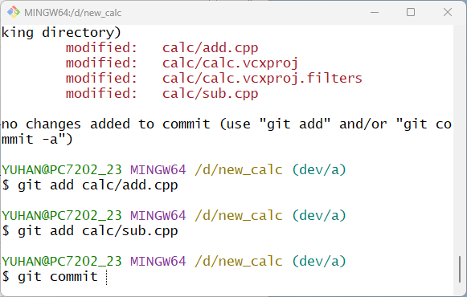
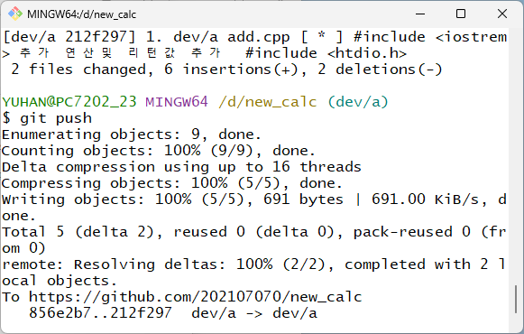
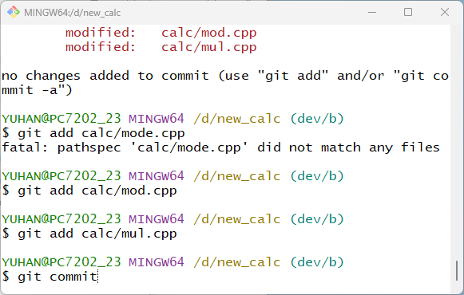
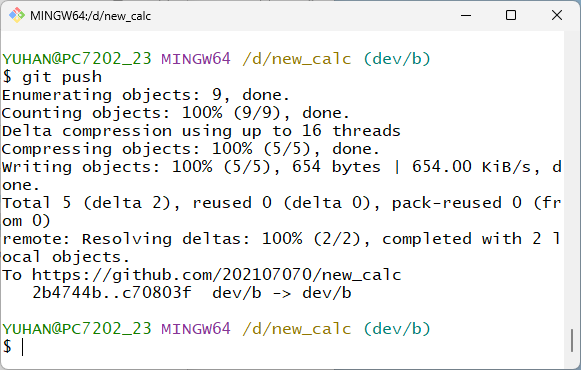
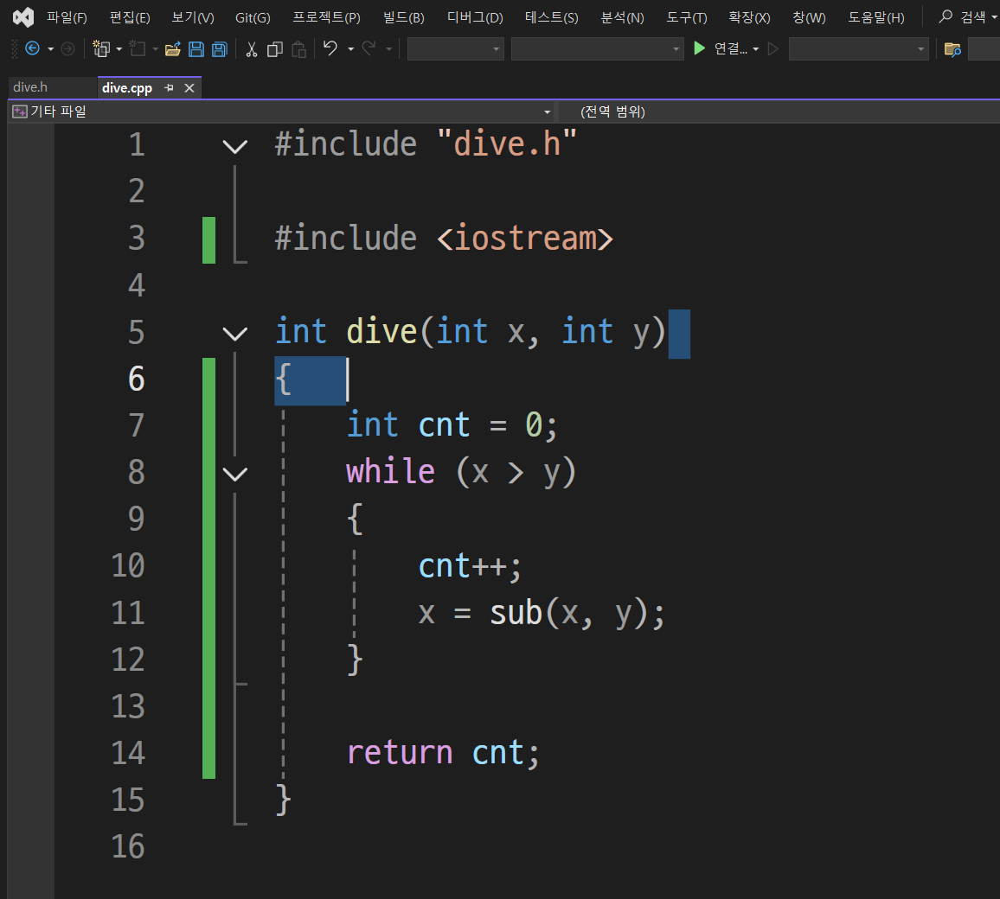
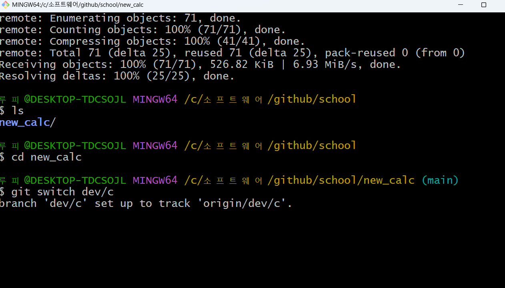
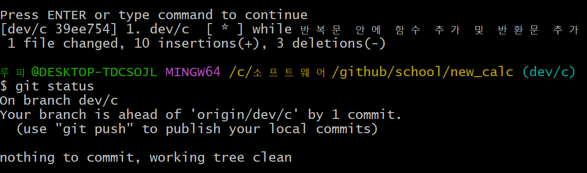
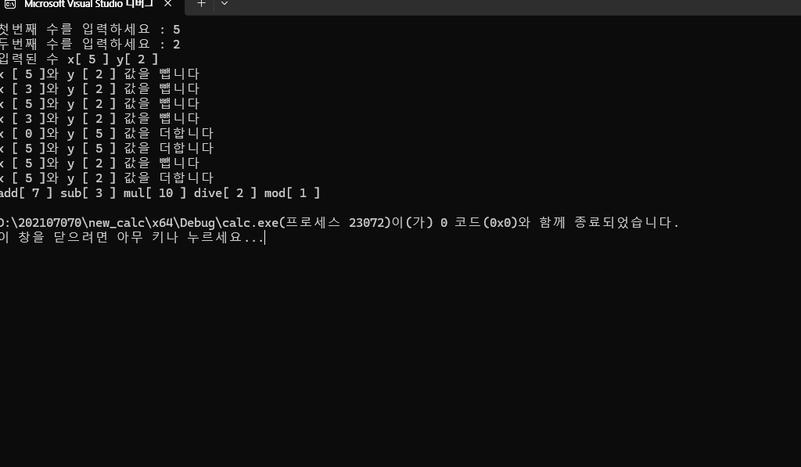

# 4기 (2024년)

### oss 기말 프로젝트 
| 조호진(팀장 - 202107070)| main브렌치 수정 및 read.md 수정 |

| 김동휘(팀원 - 202407041) | dev/c브렌치 수정 |

| 박영환(팀원 - 202207051) | dev/a, dev/b브렌치 수정  |

### 문제해결 방법과 순서
<ol>
<li>1.main 브렌치와 각 브렌치 병합</li>
<li>2. main 브렌치와 dev/b 브렌치 병합 중에 충돌 발생<li>
<li>3. 충돌 발생한 dev/b의 내용을 수정하고 3way 병합 완료<li>
<li>4. 결과 화면 캡쳐와 실행화면 캡쳐<li>
<li>readme.md 수정<li>

### 중간과정 스크린샷

